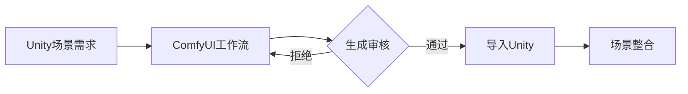

# The Lost - 游戏开发文档

## 游戏概述

### 核心理念
《The Lost》是一款以"失去"为主题的剧情向Galgame。玩家将通过一个迷失幽灵的视角，探索6位角色不同阶段经历的失去与痛苦。游戏深入探讨人类面对创伤的心理历程，涵盖失去至亲、理想、记忆、信任、健康、自我认同等主题。

### 核心玩法
- **幽灵视角机制**：无实体碰撞，可穿墙观察角色私密空间
- **记忆碎片收集**：通过触碰物品解锁角色过往记忆
- **情绪共振系统**：角色情绪波动会改变场景视觉效果（色彩/扭曲度）

## 技术栈
- **开发引擎**: Unity 2021.3 LTS
- **编程语言**: C#
- **AI生成工具**: ComfyUI + Stable Diffusion XL
- **叙事框架**: Yarn Spinner + Unity Timeline
- **渲染管线**: Unity URP (Universal Render Pipeline)

## 技术架构说明
| 模块 | 技术方案 | 作用说明 |
|------|----------|----------|
| 叙事框架 | Yarn Spinner + Unity Timeline | 分支对话系统 & 过场动画控制 |
| AI生成资源 | ComfyUI  | 生成角色记忆片段的概念美术 |
| 动态环境 | Shader Graph + Unity URP | 角色情绪驱动的场景扭曲效果 |
| 存档系统 | JSON + AES加密 | 多周目选择分支存档 |
| 本地化系统 | TextMesh Pro + JSON | 多语言支持 |

## 开发环境配置

```bash
# 1. 克隆仓库
git clone https://github.com/RuoYan/the-lost.git

# 2. 安装Unity环境
- Unity 2021.3 LTS
- 必需模块: URP, Cinemachine, Timeline

# 3. 配置AI生成工作流
# 在ComfyUI中加载预设工作流（配置文件位于 /AI_Workflows/）
character_memory_workflow.json
emotion_transfer_workflow.json

# 4. 安装关键依赖包
- DOTween Pro (动画系统)
- Fungus (基础对话框架)
- TextMesh Pro (本地化支持)
```

## 项目结构[暂定]

```
Assets/
├─ Characters/           # 角色资源
│   ├─ 01_Asher/         # 失去女儿的退伍军人
│   ├─ 02_Lena/          # 失忆症患者
│   ├─ 03_Kai/           # 失去音乐梦想的作曲家
│   ├─ 04_Maya/          # 失去健康的运动员
│   ├─ 05_Elias/         # 失去自我认同的艺术家
│   └─ 06_Sophie/        # 失去信任的记者
├─ Systems/
│   ├─ GhostMechanics/   # 幽灵交互系统
│   ├─ MemoryFragments/  # 记忆碎片收集系统
│   └─ EmotionSystem/    # 情绪视觉反馈系统
├─ AI_Generated/         # ComfyUI输出目录
│   ├─ Concepts/         # 概念图
│   ├─ MemoryVisions/    # 记忆幻觉序列
│   └─ Textures/         # 环境纹理
├─ Localization/         # 多语言文本
│   ├─ EN.json
│   ├─ ZH-CN.json
│   └─ JP.json
├─ Scenes/               # 游戏场景
│   ├─ Prologue.unity    # 序幕
│   ├─ Asher_Story.unity # Asher的故事线
│   └─ ...               # 其他场景
└─ Scripts/              # C#脚本
    ├─ Core/
    ├─ UI/
    └─ Interactions/
```

## 资源规范

### 1. 美术资源
- **角色立绘**：2048x2048 PNG + Spine骨骼动画
- **记忆碎片**：512x512 半透明PNG（带发光通道）
- **环境素材**：2048x2048 PBR纹理

### 2. 音频规范
- **BGM**：Ambient风格，44.1kHz/24bit
- **语音**：角色独白采用ASMR录音标准
- **环境音效**：立体声场设计

### 3. AI生成准则

```json
{
  "prompt": "broken pocketwatch, liquid metal texture, surrealism style, emotional decay theme",
  "negative_prompt": "text, signature, human faces",
  "steps": 30,
  "cfg_scale": 7.5,
  "sampler": "dpmpp_2m",
  "controlnet": "depth_map"
}
```

## 开发路线图

| 阶段 | 目标 | 里程碑 | 是否完成 |
|------|------|--------|----------|
| Pre-alpha | 核心叙事框架搭建 | 完成Asher完整故事线 |  |
| Alpha | 幽灵交互系统实现 | 记忆碎片收集机制验证 |  |
| Beta | 多语言支持+情绪视觉系统 | Steam页面上线 |  |
| Gold Master | 多周目剧情分支解锁 | 全平台发布 |  |

## 特别说明

### 1. 伦理审查指南
游戏涉及敏感主题（自杀/虐待等），需实现双重确认机制：

```csharp
public void ShowContentWarning(string theme) {
    warningPanel.SetActive(true);
    warningText.text = $"警告：下一场景涉及{theme}主题\n是否继续？";
    helpButton.onClick.AddListener(() => Application.OpenURL(mentalHealthResourcesURL));
}
```

### 2. 动态叙事技术
使用情感分析算法调整叙事节奏：

```csharp
float AnalyzePlayerChoices() {
    float tensionLevel = CalculateChoiceTension(lastFiveChoices);
    timeline.SetPlaybackSpeed(0.8f + tensionLevel * 0.4f);
    return tensionLevel;
}
```

### 3. AI集成工作流



## 版权声明

© 2025 RuoYan. 保留所有权利。

- 所有AI生成内容遵守 CC BY-NC 4.0 协议
- 原创代码采用 MIT 许可证
- 角色原型部分内容基于真实访谈改编，已获得受访者授权

## 开发团队

- **制作人**: RuoYan
- **叙事设计**: [姓名]
- **程序开发**: [姓名]
- **美术指导**: [姓名]
- **音乐作曲**: [姓名]

## 联系与反馈

- **项目仓库**: github.com/RuoYan/the-lost
- **合作咨询**: wx: 18266693158

---

> *"有些失去塑造我们，有些失去摧毁我们 - 但所有失去都值得被见证"*  
> ——《The Lost》核心主题
